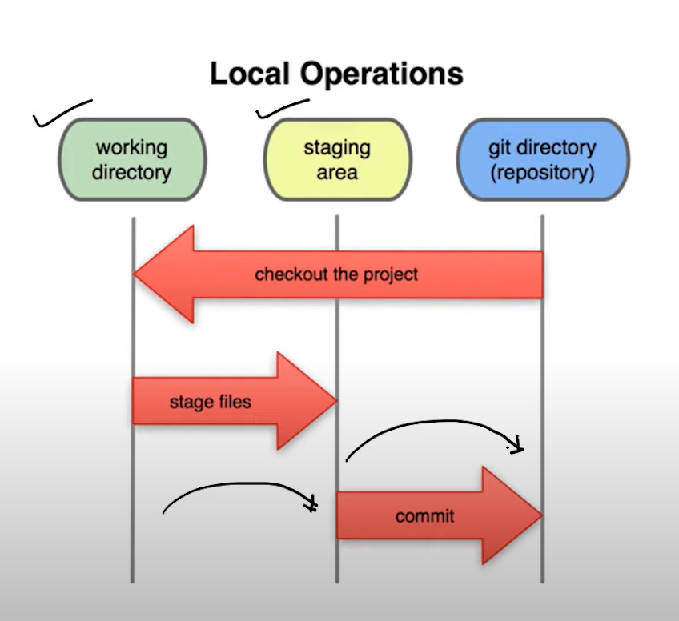
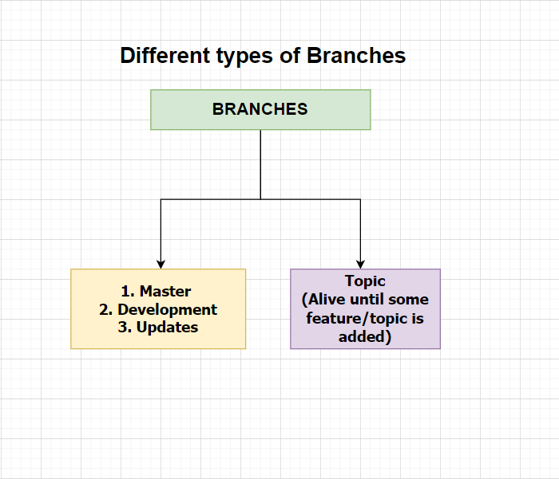

## Table of Contents

- [**Basics**](#basics)
- [**logging**](#logging)
- [**View Changes**](#changes)
- [**Revert Changes**](#revert)
- [**Branch**](#branch)
- [**Aliases**](#aliases)
- [**Remote**](#remote)
- [**Stash** - Avoiding bad commits](#stash)
- [**Miscellanous**](#miscellanous)
    - [**Adding SSH Key🔐 to Account**](#adding-ssh-key-to-account)
    - [**Configure git account**](#configuration-of-git-account-with-git-config)
    - [**Useful Commands**](#useful-commands)
- [**Remove Everything☠**](#remove-everything)
# Basics
## Life Cycle in Git

#### Initialization
```bash
git init
```

#### Get the status of files
```bash
git status 
```
#### Add to Staging area

```bash
git add . or git add -a 
```
#### Clear the staging area
```bash
git reset
```

#### Commit 
```bash
git commit -m "<msg>"
```

#### Skip staging area 
```bash
git commit -am "<msg>" or git commit -a -m "<msg>"
```
#### Cloning remote repository 
```bash
git clone <link>
```
[Back to Top ⬆](#table-of-contents)
# Logging 

#### Detailed 
```bash
git log -- or git log -p
```

#### Short 
```bash
git log --oneline
```
```bash
git shortlog
```
#### View last n commits 
```bash
git log -2
```
#### What changes were made in this commit
```bash
git show <commit-id>
```
[Back to Top ⬆](#table-of-contents)
# Changes

#### Entire project

```bash
git diff
```
#### With staged files

```bash
git diff --staged
```
#### Single file
```bash
git diff <file-name>
```

#### Compare with different commit
`Note: HEAD points to latest commit(hash value)`
```bash
git diff HEAD~2
```
[Back to Top ⬆](#table-of-contents)
# Revert

#### Match the local repo with last commit
```bash
git checkout -f
```

#### For File
```bash
git checkout -- <file-name>
```

#### To particular commit 

```bash
git checkout -b <branch-name> <hash-value of commit>
```
[Back to Top ⬆](#table-of-contents)
# Branch

#### Which branch? *
```bash
git branch 
```
#### Create and Switch to new branch 
```bash
git checkout -b <branch name>
```

#### Delete branch (gives error if not merged)
```bash
git branch -d <branch name>
```

#### Delete branch (Deletes even if not merged)
```bash
git branch -D <branch name>
```
#### list the branches with their previous commits 
```bash
git branch -v
```
#### list all branches in remote repo
```bash
git branch -r
```
#### which branches are merged?
```bash
git branch --merged 
```

#### which branches are not merged?
```bash 
git branch --no-merged 
```

#### switch to previous branch
```bash 
git checkout -
```

[Back to Top ⬆](#table-of-contents)

# Aliases
```bash
git config --global alias.<alias-name> "<original command>"
```

#### Example:  `git oneline` is alias to `git log --oneline` using `git config --global alias.oneline "log --oneline"`

#### List all the aliases
```bash
git config --list
```

[Back to Top ⬆](#table-of-contents)

# Remote 

#### What is the remote repo link? (If exists)
```bash 
git remote 
```
#### list all the remote repo links
```bash
git remote -v 
```

#### Connect `Local repo to Remote repo`
```bash
git remote add origin <SSH or link>
```
#### Remove remote link
```bash
git remove -v
```
[Back to Top ⬆](#table-of-contents)

# Stash
#### Temporarily saves the current state of a working directory
```bash
git stash
```

#### Stashing `untracked files`
```bash
git stash -u 

or 

git stash --include-untracked
```
#### Stashing `ignored files`
```bash
git stash -a

or 

git stash --all
```

#### To re-apply the changes 
```bash
git stash apply 

or

git stash apply stash@{<index>
```

#### pop
```bash
git stash pop

or 

git stash apply pop@{<index>}
```
*what is the difference b/w using apply and pop?* <br>
`apply - applies changes and does nothing afterwards` <br>
`pop - removes the changes from the stash list after they have been applied`

#### list all stashes
```bash
git stash list
```
#### stash with message
```bash
git stash save "<message>"
```

#### View changes 
```bash
git stash show 

or 

git stash show stash@{<index>}
```

#### Delete stash - To clear stack `git stash clear`
```bash
git stash drop

or

git stash drop stash@{<index>}
```
# Miscellanous 
### Adding SSH Key to Account
```bash
ssh-keygen -t ed25519 -C "<gmail>"
```
```bash
eval "$(ssh-agent -s)"
```
```bash
ssh-add ~/.ssh/id_ed25519
```
```bash 
tail  < ~/.ssh/id_ed25519.pub
```
### Configuration of git account with `git config`

#### Set name
```bash
git config --global user.name "<name>"
```
#### Set Email
```bash
git config --global user.email "<gmail>"
```

[Back to Top ⬆](#table-of-contents)
# Useful Commands 

#### Deleting a file
```bash
git rm <file-name>
```
#### Renaming a file
```bash
git rm <old-name> <new-name>
```
# Remove Everything
`Note: This will remove entire git folder`
# ☠
```bash
rm -rf ./git
```
[Back to Top ⬆](#table-of-contents)